# User Guide for SMART-DS Synthetic Electrical Network Data

## SMART-DS

The SMART-DS datasets (Synthetic Models for Advanced, Realistic Testing: Distribution systems and Scenarios) are realistic large-scale U.S. electrical distribution models for testing advanced grid algorithms and technology analysis. This document provides a user guide for the datasets.

- [User Guide for SMART-DS Synthetic Electrical Network Data](#user-guide-for-smart-ds-synthetic-electrical-network-data)
  - [SMART-DS](#smart-ds)
  - [Dataset Features](#dataset-features)
    - [Network](#network)
    - [Electrical Components](#electrical-components)
    - [Design](#design)
    - [Loads](#loads)
    - [SMART-DS Scenarios](#smart-ds-scenarios)
      - [Integrated Scenarios](#integrated-scenarios)
      - [Placement Scenarios](#placement-scenarios)
  - [Dataset Structure](#dataset-structure)
    - [GIS](#gis)
    - [Placements](#placements)
    - [Years](#years)
    - [Datasets](#datasets)
      - [SAF](#saf)
      - [GSO](#gso)
      - [SFO](#sfo)
      - [AUS](#aus)
    - [Sub-Regions](#sub-regions)
    - [Scenarios](#scenarios)
      - [Metrics](#metrics)
      - [CYME](#cyme)
      - [OpenDSS](#opendss)
      - [OpenDSS with no Loadshapes](#opendss-with-no-loadshapes)
    - [Substation](#substation)
    - [Feeder](#feeder)
    - [Analysis](#analysis)
    - [Full Dataset Analysis](#full-dataset-analysis)
  - [Running Powerflow in CYME](#running-powerflow-in-cyme)
    - [CYME Model Creation](#cyme-model-creation)
    - [CYME Timeseries Profile Creation](#cyme-timeseries-profile-creation)
    - [CYME volt-var and volt-watt Curve Creation](#cyme-volt-var-and-volt-watt-curve-creation)
    - [Exploring CYME Models](#exploring-cyme-models)
    - [Loadflow Analysis for Peak Planning Scenarios in CYME](#loadflow-analysis-for-peak-planning-scenarios-in-cyme)
    - [Loadflow Analysis for Timeseries Scenarios in CYME](#loadflow-analysis-for-timeseries-scenarios-in-cyme)
  - [Running Powerflow in OpenDSS](#running-powerflow-in-opendss)
    - [Using OpenDSS GUI](#using-opendss-gui)
    - [Using opendssdirect](#using-opendssdirect)
    - [Appendix 1. Scenario Descriptions](#appendix-1-scenario-descriptions)
      - [Customer Solar](#customer-solar)
      - [Utility Solar](#utility-solar)
      - [Customer Batteries](#customer-batteries)
      - [Utility Batteries](#utility-batteries)
      - [Small Demand Responsive Loads](#small-demand-responsive-loads)
      - [Large Demand Responsive Loads](#large-demand-responsive-loads)
      - [Grid Monitoring Equipment](#grid-monitoring-equipment)
      - [Residential Electric Vehicles](#residential-electric-vehicles)
      - [Commercial Electric Vehicles](#commercial-electric-vehicles)
      - [Line Outages](#line-outages)

## Dataset Features

### Network

The electrical models have been produced in CYME and OpenDSS formats. They capture electrical connections at all levels of distribution systems including sub-transmission lines, substations, distribution feeders and secondaries from distribution transformers to customers. The models are embedded in both rural and urban geographic areas. They connect to real buildings which have synthetic load patterns attached to them. However, the networks themselves are entirely synthetic and do not reveal any proprietary or critical infrastructure information.

### Electrical Components

In addition to physical connections, these models capture important electrical properties of the networks such as line phasing and impedances, ratings of transformers and numerous other equipment parameters. Protection designs and equipment such as fuses, reclosers, GOABs and open switches between adjacent feeders are also represented. Voltage management equipment such as regulators and capacitors are strategically located on certain feeders that would otherwise face power quality issues.

### Design

The [Reference Network Model](https://www.iit.comillas.edu/technology-offer/rnm) for US systems ([RNM-US](https://ieeexplore.ieee.org/abstract/document/9121324)) was used to automatically size and place electrical equipment such as lines and transformers in order to support peak planning loads. Various design configurations considering voltage class, rural vs. urban layouts and delta vs. wye configurations were captured in different SMART-DS regions. A rich set of feeder designs was produced to capture the diversity of electrical designs seen in real distribution systems. Extensive validation of these synthetic feeder designs was [performed](https://ieeexplore.ieee.org/abstract/document/9043892) to compare the statistical probability distribution of key metrics to real feeder information from utilities accross the US. Extensive post-processing was then applied to the networks to apply several changes before the models were exported to OpenDSS or CYME:

- Apply triplex configurations to low-voltage lines (with limited line doubling)
- Assign components to feeders and substations
- Assign capacitor and regulator controllers
- Add intermediate nodes to long lines
- Adjust the positioning of lines and node for visualization in CYME
- Add substation internals
- Add fuse settings
- Add switches to long lines
- Add reclosers
- Add PV devices
- Add batteries
- Attach timeseries load and solar profiles
- Increase line and transformer capacity to prevent overloads for timeseries scenarios
- Compute metrics

### Loads

The SMART-DS models have been created with both peak planning loads and timeseries loads attached. Loads in the peak scenario are represented by a real (kW) and reactive (kVar) power load, which reflect the maximum load expected on the network at any one time. Timeseries loads for 365 days of 2016, 2017 and 2018 are provided (with the final day of the leap year 2016 truncated), which results in 35040 distinct load snapshots in total. Residential and commerical load profiles were produced using the [Restock](https://www.nrel.gov/buildings/resstock.html) and [Comstock](https://www.nrel.gov/buildings/comstock.html) models respectively, and assigned to buildings such that the maximum total load was comparible to the total peak planning load. Loads in the peak planning scenarios were determined by the type of building, building footprint, number of building stories and geographical location. Loads in the timeseries scenario are represented by 15 minute resolution real and reactive load profiles for a year. End-use breakdowns are also provided for each timeseries profile.

In the P2U region of the SFO dataset, a mesh-secondary load is attached to represent downtown San Francisco. To create a mesh-secondary load profile, office timeseries profiles were assigned to the loads of the [IEEE 342 node system](https://ieeexplore.ieee.org/document/6939794), available in OpenDSS format [here](https://sourceforge.net/p/electricdss/code/HEAD/tree/trunk/Version8/Distrib/IEEETestCases/LVTestCaseNorthAmerican/Master.dss). These profiles were then aggregated and attached to the SMART-DS high voltage network as a single lumped load.

### SMART-DS Scenarios

The SMART-DS datasets include integrated scenarios and placement scenarios to support standardization accross modelling efforts. Placement scenarios provide a json file describing the location of scenario components. Integrated scenarios additionally include OpenDSS and CYME representations of scenario components. Both types of scenarios represent grid-related features that are included in the datasets. Details of the scenario classifications are included in the [Appendix 1](#Appendix-1.-Scenario-Descriptions). Sizing of grid-related features does not presently consider the network topology, which may cause line and transformer overloads as well as voltage violations in the integrated scenarios.

#### Integrated Scenarios

Photovoltaic and battery equipment are both represented using integrated scenarios. These scenarios include both distributed and utility-scale battery and solar installations with different penetrations and settings. For timeseries solar scenarios, locational irradiance timeseries data is also provided. Timeseries dispatch of batteries is not presently included in the datasets.

#### Placement Scenarios

Placement scenarios are used to represent components which are more difficult to connect to grid simulations, or which may have customized configurations. Placements contain a json file for each scenario, which list the location of scenario components. The scenarios currently represented by placements are:

- Commercial electric vehicle charging locations (low, medium, high, extreme)
- Residential electric vehicle charging locations (low, medium, high, extreme)
- Line outages (low, medium, high, extreme)
- Large demand responsive loads (low, medium, high)
- Small demand responsive loads (low, medium, high)
- Grid monitoring equipment (low, medium, high, extreme)
- Customer photovoltaic installations (low, medium, high, extreme)
- Utility photovoltaic installations (medium, high, extreme)
- Customer battery installations (low, high)
- Utility battery installations (high)

Placement files are provided for solar and battery scenarios in addition to their integrated CYME and OpenDSS representations.

## Dataset Structure

In the OEDI data repository, the SMART-DS is organized in a heirarchical manner. At a high level, the data folder structure is organized as shown below:

```
SMART-DS
│
└─── <GIS>
│
└─── <PLACEMENTS>
│
└─── <YEARS>
    │
    └─── <DATASETS>
         │
         └──── full_dataset_analysis
         │
         └─── <SUB-REGIONS>
              │
              └──── profiles
              │
              └──── cyme_profiles
              │
              └──── load_data
              │
              └──── solar_data
              │
              └──── load_curves
              │
              └──── <SCENARIOS>
                     │
                     └──── metrics.csv
                     │
                     └──── cyme
                     │
                     └──── opendss
                     │     │
                     │     └──── analysis
                     │     │
                     │     └──── <SUBSTATIONS>
                     │           │
                     │           └──── analysis
                     │           │
                     │           └──── <FEEDERS>
                     │                 │
                     │                 └──── analysis
                     │
                     └──── opendss_no_loadshapes
                           │
                           └──── <SUBSTATIONS>
                                 │
                                 └──── <FEEDERS>

```

Labels in angle brackets describe categories of folders, which are described in the following sections.

### GIS

For each dataset, shapefile information is provided with an acompanying .qgs file (SFO_QGIS.qgs, AUS_QGIS.qgs, GSO_QGIS.qgs or SAF_QGIS.qgs) to view the datasets using tools such as [QGIS](https://www.qgis.org/en/site/). The GIS information can assist with visualizing the datasets, but is produced from the raw RNM outputs. This means that it doesn't include any modifications made in post-processing, but does provide valuable information about electrical equipment locations. The .qgs project references layers that are provided for each sub-region of the dataset.

When viewing the shapefile information, the layers for each sub-region are:

- Transmission substations (230kV to 69kV)
- Distribution substations (69kV to 4/12.47/25kV)
- Switches
- Distribution Transformers
- Voltage Regulators
- Capacitors
- Loops
- Feeders
- Power Lines
- Customer Loads
- Steiner Nodes (used by RNM)
- Streets

For example, GSO (with three sub-regions) contains three separate distribution transformer layers. These layers can be added or removed and augmented with base map layers such as sattelite or streetmap data. Meta-data included in the shapefile is included for grouping. The feeder layers are grouped by feeder. The Power line layers are grouped by phasing. Different color schemes can be used by selecting different columns in the layer properities for categorized layers, as shown below.

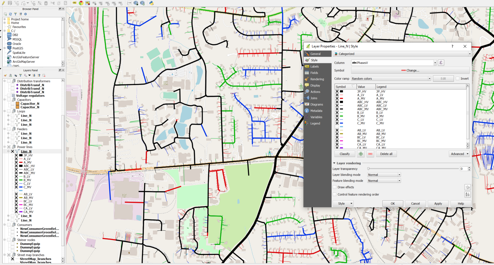

If not all the shapefiles are available to the .qgs project file (e.g. if only a subset sub-regions were downloaded), Auto-find can be used to load the available layers as shown below.


### Placements

For each dataset, placements are provided for each sub-region, as described [here](#Placement-Scenarios). The placements are json files, with a base object indexed by feeder or substation. The values of each feeder/substation are a list of the name of the element (e.g. load or line) included in the placement. The format used is \<scenario\>=\<penetration\>.json, where the penetrations of low, medium, high and extreme scenarios are represented by L, M, H, E respectively. The naming used for the scenarios is:

- ev_commercial: Commercial electric vehicle charging locations
- ev_residential: Residential electric vehicle charging locations
- line_outages: Line outages
- demand_response_large: Large demand responsive loads
- demand_response_small: Small demand responsive loads
- visibility: Grid monitoring equipment
- pv_customer: Customer photovoltaic installations
- pv_utility: Utility photovoltaic installations
- battery_customer: Customer battery installations
- battery_utility: Utility battery installations

### Years

SMART-DS offers two types of case studies, peak planning scenarios and timeseries scenarios, as described in [Loads](#Loads). The folders included are:

- peak
- 2016
- 2017
- 2018

### Datasets

The SMART-DS datasets have been built in the geographic areas of:

- Santa Fe, NM (SAF)
- Greensboro, NC (GSO)
- Extended San Francisco Bay Area, CA (SFO)
- Austin, TX (AUS)

A full respresentation of the distribution systems in the state of Texas is forthcoming as part of a synthetic integrated Transmission-Distribution model for the entire ERCOT footprint.

#### SAF

The Santa Fe dataset is the smallest SMART-DS dataset and contains only one sub-region for Santa Fe county in New Mexico. The SAF dataset has only been generated with peak loads and does not contain timeseries scenarios. The SAF dataset is shown below:
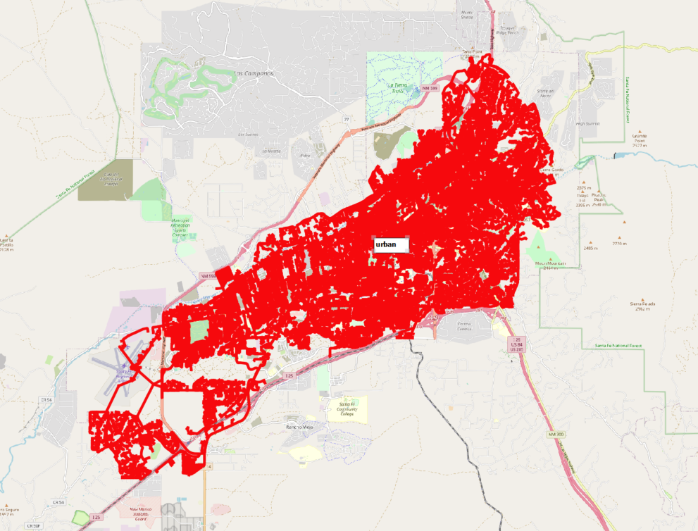

#### GSO

The Greensboro dataset contains three sub-regions:

- urban-suburban
- industrial
- rural

The rural dataset is structured with rural network topologies while both the urban-suburban and industrial have urban network structures.

The relative locations of these sub-regions is shown below:
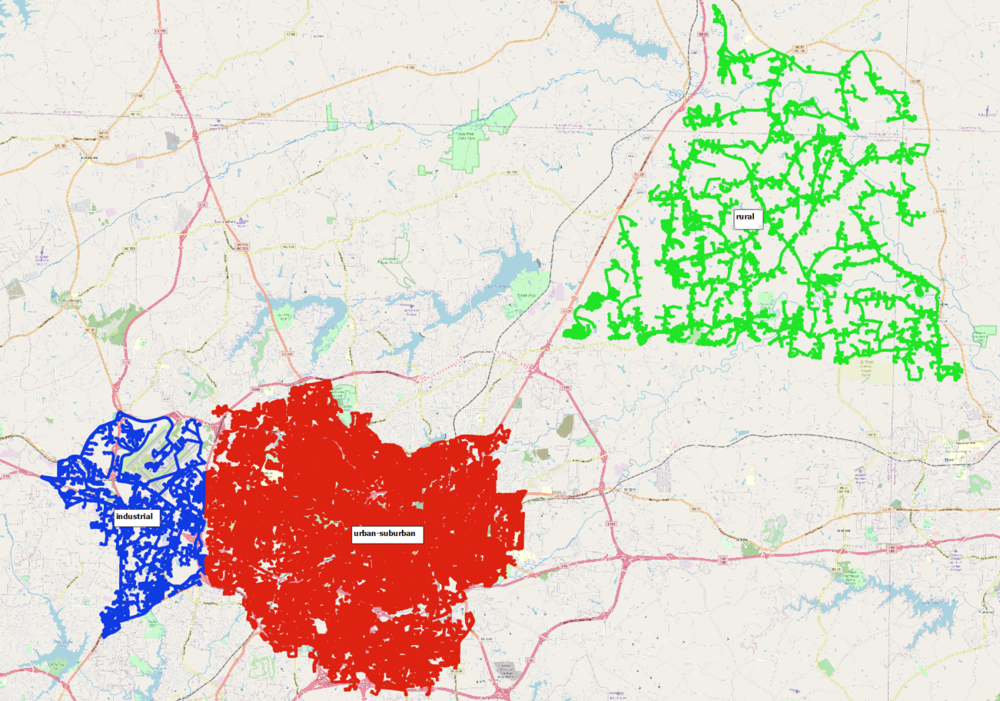

#### SFO

The extended San Francisco bay area model is the flagship SMART-DS dataset. It contains forty sub-regions which span both urban and rural geographies. The 35 urban sub-regions are named P1U to P35U, and the 5 rural sub-regions are named P1R to P5R. Table 1 describes the configurations used in each sub-region

|Sub-Region|Type|Nominal Voltage|Regulators|Capacitors|Wire Configuration|
|----|--------|---------|----|------|----------|
|P1R |Rural |12.47 kV|Yes |No|delta-wye|
|P2R |Rural |25 kV|Yes|No|delta-wye|
|P3R |Rural |12.47 kV|Yes |Yes|delta-wye|
|P4R |Rural |12.47 kV|No|Yes|delta-wye|
|P5R |Rural |12.47 kV|No|Yes|delta-wye|
|P1U |Urban |12.47 kV|No|Yes|delta-wye|
|P2U |Urban |12.47 kV|Yes|Yes|delta-wye|
|P3U |Urban |12.47 kV|No|Yes|delta-wye|
|P4U |Urban |4 kV|No  |No|delta-wye|
|P5U |Urban |12.4 7kV|No|Yes|delta-wye|
|P6U |Urban |12.47 kV|No|Yes|delta-wye|
|P7U |Urban |12.47 kV|No|Yes|delta-wye|
|P8U |Urban |12.47 kV|No|Yes|delta-wye|
|P9U |Urban |12.47 kV|No|Yes|delta-wye|
|P10U |Urban |12.47 kV|No|Yes|delta-delta|
|P11U |Urban |12.47 kV|No|Yes|delta-wye|
|P12U |Urban |12.47 kV|No|Yes|delta-wye|
|P13U |Urban |12.47 kV|No|Yes|delta-wye|
|P14U |Urban |12.47 kV|No|Yes|delta-wye|
|P15U |Urban |12.47 kV|No|Yes|delta-wye|
|P16U |Urban |12.47 kV|No|Yes|delta-wye|
|P17U |Urban |12.47 kV|No|Yes|delta-wye|
|P18U |Urban |12.47 kV|No|Yes|delta-wye|
|P19U |Urban |12.47 kV|No|Yes|delta-wye|
|P20U |Urban |12.47 kV|No|Yes|delta-wye|
|P21U |Urban |12.47 kV|No|Yes|delta-wye|
|P22U |Urban |12.47 kV|No|Yes|delta-wye|
|P23U |Urban |12.47 kV|No|Yes|delta-wye|
|P24U |Urban |12.47 kV|No|Yes|delta-wye|
|P25U |Urban |12.47 kV|No|Yes|delta-wye|
|P26U |Urban |12.47 kV|No|Yes|delta-wye|
|P27U |Urban |12.47 kV|No|Yes|delta-wye|
|P28U |Urban |12.47 kV|Yes|Yes|delta-wye|
|P29U |Urban |12.47 kV|No|Yes|delta-wye|
|P30U |Urban |12.47 kV|No|Yes|delta-wye|
|P31U |Urban |12.47 kV|No|Yes|delta-wye|
|P32U |Urban |12.47 kV|No|Yes|delta-wye|
|P33U |Urban |12.47 kV|No|Yes|delta-delta|
|P34U |Urban |12.47 kV|No|Yes|delta-delta|
|P35U |Urban |4 kV|No|No|delta-wye|

The location of each region is shown below:
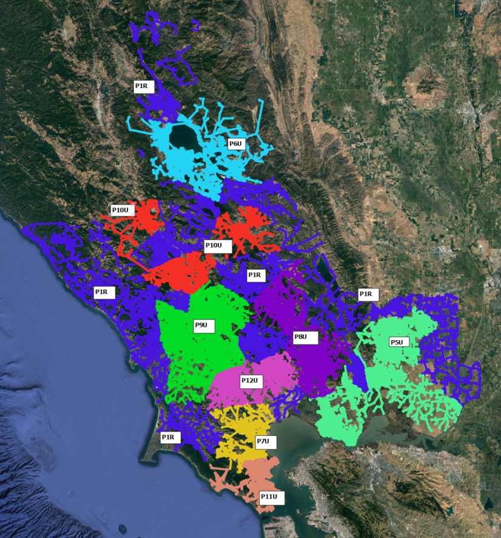
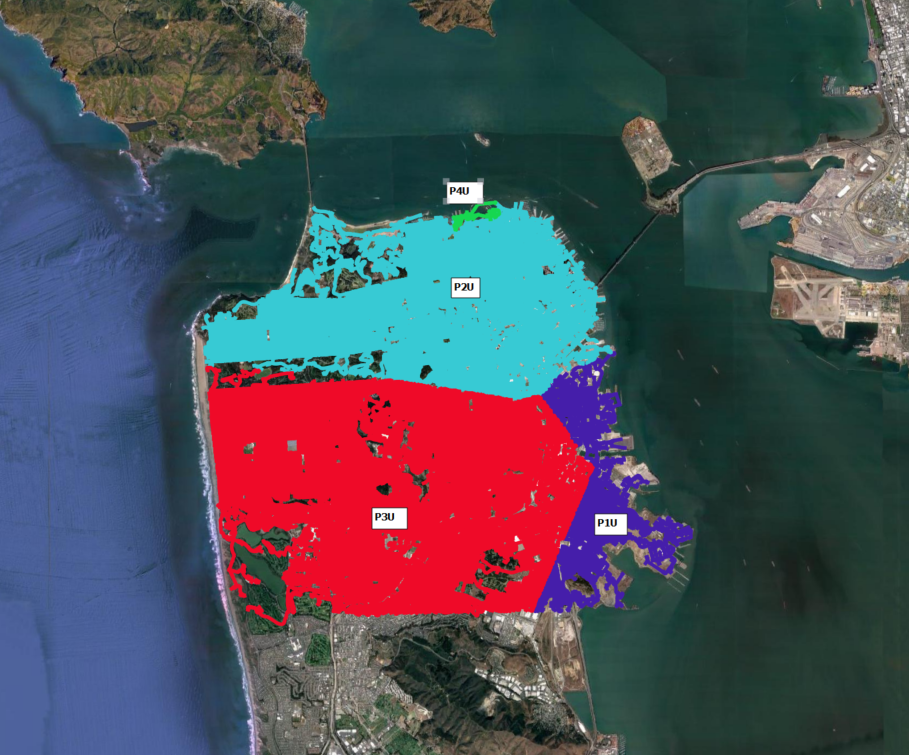
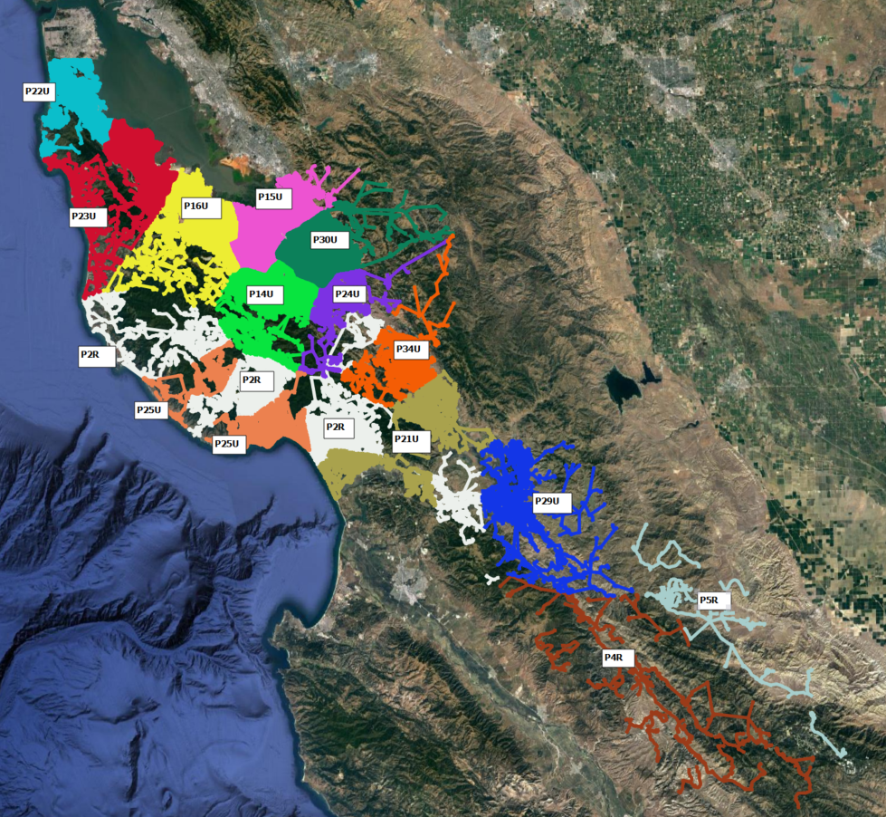


#### AUS

The Austin dataset contains six sub-regions with the same naming convention as the SFO dataset. It contains five urban regions P1U-P5U and one rural regoin P1R. The Austin dataset also contains a small Powerworld transmission [model](https://ieeexplore.ieee.org/abstract/document/9216129), which can be used to co-simulate transmission and distribution models as described [here](https://ieeexplore.ieee.org/document/9384935).
The location of each region is shown below:
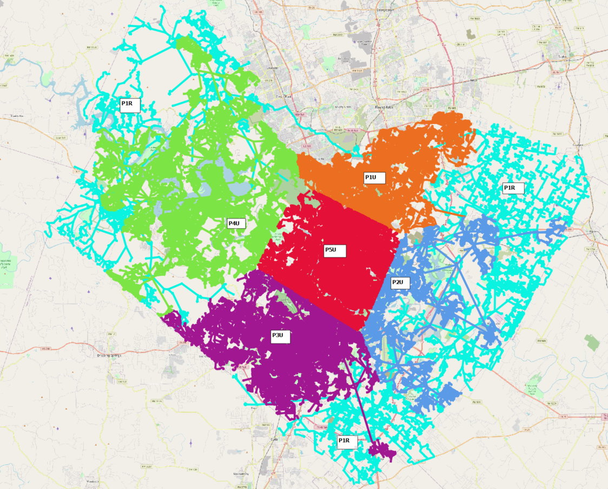

### Sub-Regions

The purpose of sub-regions is to provide a more tractible dataset size which can be downloaded and run in isolation, while still containing multiple substations under a single connected dataset. As described in [Locations](#Locations), each dataset contains multiple sub-regions with a 230kV source node named "st_mat" and a 69 kV subtransmission network connecting the sub-region's distribution substations. The sub-regions have diversity in wire configurations, voltage class, voltage management and urban/rural designs. Each sub-region contains the following files and folders (folders in bold):

- **profiles:** A folder containing all the load and solar timeseries profiles that are used by the opendss models in the sub-region. Load timeseries profiles are provided in single-column, headerless csv format with loads represented as a fraction of the maximum load in the year (1.0 being the maximum). The following naming convention is used for the load profiles: \<customer class\>\_\<load type\>\_\<profile id\>\_pu.csv. Solar irradiance profiles are also provided in a single-column, headerless csv format which represents the plane-of-array irradiance of the panels in kW/m<sup>2</sup>. The following naming convention is used for solar profiles: \<dataset\>\_\<latitude\>\_\<longitude\>\_\<tilt\>\_\<azimuth\>\_full.csv.
  - customer class: "res" or "com" for residential or commercial
  - load type: "kw" or "kvar" for real or reactive power
  - profile id: A timeseries identifier within the res and com classes. These identifiers are not unique accross multiple years.

  - dataset: The relevant dataset (SFO, GSO, AUS)
  - latitude/longitude: The NSRDB location which is used for the solar information.
  - tilt: The tilt (in degrees) that the solar panels are positioned relative to horizontal
  - azimuth: The direction that the panels face (e.g. south being 180, east being 90 etc).

- **cyme_profiles:** A folder containing all the load and solar timeseries files required to run powerflow in CYME for a year. Load and solar generation profiles are provided for each day of the year in separate files. Each file contains all the load or generation profiles used within the region. The file formats used for each day are:

  - cyme_load_timeseries_day_\<day\>.txt
  - cyme_solar_timeseries_day_\<day\>.txt

- **load_data:** A folder containing parquet files for each customer profile. The format of \<customer class\>\_\<profile id/>.parquet is used, where customer class is either "res" or "com" and the profile id is the customer profile identifier.  In addition to the time, building identifier (profile id), power factor (pf), total real and reactive loads, these files contain a a full breakdown of real and reactive end-use loads. The list of columns contained in the parquet files is:

  - Time
  - total_site_electricity_kw
  - building
  - pf
  - total_site_electricity_kvar
  - heating_kw
  - heating_kvar
  - cooling_kw
  - cooling_kvar
  - lighting_kw
  - lighting_kvar
  - fans_kw
  - fans_kvar
  - pumps_kw
  - pumps_kvar
  - water_systems_kw
  - water_systems_kvar
  - refrigeration_kw
  - refrigeration_kvar
  - motors_kw
  - motors_kvar
  - plug_loads_kw
  - plug_loads_kvar
  - clothes_dryer_kw
  - clothes_dryer_kvar
  - clothes_washer_kw
  - clothes_washer_kvar
  - stove_kw
  - stove_kvar
  - dishwasher_kw
  - dishwasher_kvar

- **solar_data:** A folder containing all the solar timeseries data for each type of configuration. Files are named \<dataset\>\_\<latitude\>_\<longitude\>\_\<tilt\>\_\<azimuth\>\_full.csv. The dataset is the relevant dataset (SFO, GSO, AUS), and latitude/longitude refer to the NSRDB location which is used for the solar information. Tilt is the tilt (in degrees) that the solar panels are positioned relative to horizontal, and azimuth is the direction that the panels face (e.g. south being 180, east being 90 etc). The solar information of Direct Normal Irradiance (DNI), Direct Horizontal Irradiance (DHI) and Global Horizontal Irradiance (GHI), wind speed and temperature information were obtained from the [National Solar Radiation Database](https://nsrdb.nrel.gov/) (NSRDB) at half hour resolution and interpolated to 15 minutes. [PV Watts](https://pvwatts.nrel.gov/) was used to determine the Plane of Array (PoA) irradiance for the tilt and azimuth of the panels along with generation for a 1MW array instalation at the specified location, tilt and azimuth. Note that irradiances are provided in W/m<sup>2</sup>, as opposed to data in the profiles folder which uses kW/m<sup>2</sup>. The list of fields are included in each file are:

  - Year
  - Month
  - Day
  - Hour
  - Minute
  - DNI
  - DHI
  - Wind Speed
  - Temperature
  - GHI
  - PoA Irradiance (W/m^2)
  - kW Generated (1000 kW Array)

- **load_curves:** A folder containing plots of the timeseries load for each day of the year. Plots are provided for the aggregate load of the entire  sub-region, as well as aggregate load for each substation and feeder. A folder is provided with the format \<sub-region\>\_\_\<substation name\>\_\_\<feeder_name\>, for feeders, \<sub-region\>\_\_\<substation name\> for substations, and \<sub-region\> for load curves of the entire sub-region. The file total_overlay_\<n\>.png contains a plot of the total residential load, total commercial load and total combined load on day "n" at 15 minute resolution. Days range from 1 (January 1st) to 365 (December 31st in 2017-2018 or December 30th in 2016). An example load-curve for the region of P10U is shown below:

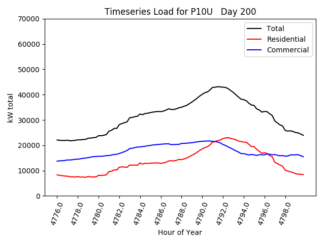

### Scenarios

The scenario folders cover the different types of [integrated scenarios](#Integrated-Scenarios) represented in SMART-DS. Within these scenarios, the network structure remains consistent but various deployments of solar and batteries are integrated into the CYME and OpenDSS models.

List of solar scenarios are:

- none
- low
- medium
- high
- extreme

And the list of battery scenarios are:

- none
- low
- high

All combinations of these solar and battery scenarios are provided. "base_timeseries" and "base_peak" refer to the timeseries and peak scenarios with no solar or battery equipment. The naming convention follows solar\_\<solar scenario\>\_batteries\_\<battery scenario\>\_\<timeseries type\>,  where the timeseries type is "timeseries" for the years 2016-2018 and "peak" for the peak planning scenario.

Hence the list of scenarios for the year 2016 is:

- base_timeseries
- solar_none_batteries_low_timeseries
- solar_none_batteries_high_timeseries
- solar_low_batteries_none_timeseries
- solar_low_batteries_low_timeseries
- solar_low_batteries_high_timeseries
- solar_medium_batteries_none_timeseries
- solar_medium_batteries_low_timeseries
- solar_medium_batteries_high_timeseries
- solar_high_batteries_none_timeseries
- solar_high_batteries_low_timeseries
- solar_high_batteries_high_timeseries
- solar_extreme_batteries_none_timeseries
- solar_extreme_batteries_low_timeseries
- solar_extreme_batteries_high_timeseries

Each integrated scenario contains a metrics.csv file, cyme folder, an opendss folder, and an opendss_no_loadshapes folder.

#### Metrics

Within each scenario folder, a file titled metrics.csv is provided. This provides numerous statistical metrics for each feeder in the sub-region, including the solar and battery systems included in the scenario. The full list of metrics is:

- Feeder Name
- Feeder Head Node
- Substation Name
- Medium Voltage Length (miles)
- Three Phase Medium Voltage Length (miles)
- Three Phase Overhead Medium Voltage Length (miles)
- Two Phase Medium Voltage Length (miles)
- Two Phase Overhead Medium Voltage Length (miles)
- Single Phase Medium Voltage Length (miles)
- Single Phase Overhead Medium Voltage Length (miles)
- Overhead Percentage of Medium Voltage Line Miles
- Ratio of Medium Voltage Lines to Number of Customers
- Maximum Node Distance From Substation (miles)
- Nominal Voltage of Source (kV)
- Low Voltage Length (miles)
- Three Phase Low Voltage Length (miles)
- Three Phase Overhead Low Voltage Length (miles)
- Two Phase Low Voltage Length (miles)
- Two Phase Overhead Low Voltage Length (miles)
- Single Phase Low Voltage Length (miles)
- Single Phase Overhead Low Voltage Length (miles)
- Maximum Line Length From Transformer to Load (miles)
- Overhead Percentage of Low Voltage Line Miles
- Ratio of Low Voltage Lines to Number of Customers
- Number of Voltage Regulators
- Number of Capacitors
- Average Regulator Distance From Substation (miles)
- Average Capacitor Distance From Substation (miles)
- Number of Fuses
- Number of Reclosers
- Average Recloser Distance From Substation (miles)
- Number of Breakers
- Number of Switches
- Number of Lines Connected to Adjacent Feeder
- Number of Closed Loops
- Number of Transformers
- Total Transformer Capacity (MVA)
- Number of Single Phase Transformers
- Number of Three Phase Transformers
- Ratio of Single Phase Transformers to Three Phase Transformers
- Total Planning Load (MW)
- Total Phase A Planning Load (MW)
- Total Phase B Planning Load (MW)
- Total Phase C Planning Load (MW)
- Total Reactive Planning Load (MVar)
- Percentage of Low Voltage Planning Load on Phase A
- Percentage of Low Voltage Planning Load on Phase B
- Percentage of Low Voltage Planning Load on Phase C
- Number of Single Phase Low Voltage Loads
- Number of Three Phase Low Voltage Loads
- Number of Medium Voltage Loads
- Total Medium Voltage Planning Load (MW)
- Average Number of Loads per Transformer
- Average Planning Load Power Factor
- Average Planning Load Imbalance by Phase
- Total Number of Customers
- Number of Customers per Square Mile of Feeder Convex Hull
- Total Planning Load (MW) per Square Mile of Feeder Convex Hull
- Total Reactive Planning Load (MVar) per Square Mile of Feeder Convex Hull
- Total Transformer Capacity (MVA) per Square Mile of Feeder Convex Hull
- Average Node Degree
- Average Shortest Path Length
- Diameter (Maximum Eccentricity)
- Number of PVs
- Total PV Capacity (MW)
- Number of PVs with Volt- Var Control
- Total Capacity of PVs with Volt- Var Control (MW)
- Number of PVs with Volt- Watt and Volt- Var Control
- Total Capacity of PVs with Volt- Watt Volt- Var Control (MW)
- Number of Batteries
- Total Capacity of Batteries (MW)
- Average Year of Building Construction
- Average Land Value (USD per Square Foot)
- Percentage of Rural Customers
- Percentage of Urban Customers
- Percentage of Residential Customers
- Percentage of Commercial Customers
- Percentage of Industrial Customers
- County
- Line Configuration

#### CYME

The cyme folder contains the files:

- network.txt
- equipment.txt
- loads.txt

For scenarios where volt-var and volt-watt curves are used, the cyme config files of [IEEE 1547 category B](https://standards.ieee.org/standard/1547-2018.html) curves are also included:

- 1547_VOLT-VAR_CAT_B.cymcfg
- 1547_VOLT-WATT_CAT_B.cymcfg

The cyme files are exported using [DiTTo](https://github.com/NREL/ditto/) and are compatible with CYME 9.0 rev 5. They can be read by using CYME's ASCII importing functionality.

#### OpenDSS

 The file Master.dss within the opendss folder can be used to run the entire sub-region, with the source at a 230kV transmission node. The opendss folder has separate sub-folders for each substation and sub-sub-folders for each feeder. Each of these contains their own Master.dss file which can be used to run a sub-network. Components from substations and feeders are referenced through the sub-folder heirarchy. OpenDSS objects are described through component specific files:

- **Master.dss:** The start of the network, which references all components
- **Buscoords.dss:** The longitude and latitude of each node
- **Transformers.dss:** Transformers on the network
- **LineCodes.dss:** Line configuration of the system (impedance and ampacity)
- **Lines.dss:** Lines, fuses, switches, reclosers and breakers
- **LoadShapes.dss:** Loadshapes and solar irradiances which reference data in the profiles folder
- **Loads.dss:** Loads with reference to Loadshapes for timeseries
- **Capacitors.dss:** Capacitors and their controlers
- **Regulators.dss:** Voltage regulators both in substations and on lines
- **PVSystems.dss:** Utility and distributed solar photovoltaic units
- **Storage.dss:** Battery systems located at substations or a load connection points.

The models can be run using the open-source OpenDSS software located [here](https://smartgrid.epri.com/SimulationTool.aspx), with python libraries [here](https://pypi.org/project/OpenDSSDirect.py/)

Additionally, a file **Intermediates.txt** is provided. This contains a list of intermediate nodes (non-terminal nodes) for each line, separated by semicolons. Intermediate notes are not used by OpenDSS, but describe the topology of the line, and are useful for geographic visualization.

An important distinction between the timeseries and peak scenarios is that the kW and kvar values in the peak scenario Loads.dss file are co-incident peak planning loads, which reflect the maximum load expected on the network at any one time. However, kW and kvar values in the timeseries scenario Loads.dss files are the maximum power drawn by the load at any time throughout the year, but are scaled by the load multiplier profiles referenced in the LoadShapes.dss file, with a maximum value of 1.0.

Another important point to note in the Loads.dss files, is that loads connected to center-tap transformers are divided equally between the two active and neutral lines, resulting in two equal loads which are half of the total customer load. However, the parquet files describe the load for the entire customer - not half of the connection. This is important to be aware of when programatically updating loads from timeseries files. These loads have a "_1" or "_2" at the end of their name. Solar and battery installations connected accross the two active lines and do not face this issue.

#### OpenDSS with no Loadshapes

The opendss_no_loadshapes folder provides timeseries OpenDSS models without active references to Loadshapes. At the time of release, loading a full year of timeseries data for thousands of loads can be very time and memory intensive in OpenDSS. Some users may want to use opendssdirect to simulate only  specific timepoints of the year. The Loads.dss files in the opendss_no_loadshape folder provides the same kW and kvar values as the Loads.dss files in the opendss folder, but comment out the yearly profile.

Because loadshape information is not included in the opendss_no_loadshapes folders, the Solve command is not provided in the Master.dss file. Running the opendss files without setting load values using opendssdirect would result in the maximum yearly value of each load being applied simultaneously (without the simultanaity factors that are used in the peak planning scenario).

Examples of how to set load values using opendssdirect are shown in the [code](#opendssdirect-Code) section below.

### Substation

Within each sub-region of in the opendss and opendss_no_loadshapes folder, one or more substations are represented in separate folders. Each substation connects to the 69kV subtransmission network and serves one or more distribution feeders at voltages from 4kV to 25kV. Various substation designs are captured, and load tap changer (LTC) voltage regulators are connected to each substation transformer. This structure allows a substation to be simulated from its connection to the subtransmission network independently from the rest of the sub-region. The substation can be simulated by running the Master.dss file located in its folder. An example substation folder is p1uhs0_1247 (supplying 12.47 kV feeders in sub-region P1U). An additional folder named "subtransmission" contains all the subtransmission network components connecting substations to the transmission system.

### Feeder

Within each substation folder in the opendss and opendss_no_loadshapes folders are one or more feeder folders. For smaller studies, these single feeders can be simulated with a fixed voltage at the feeder head. The metric.csv file can be used to identify representative feeders with desired properties, as described in [Metrics](#Metrics).

### Analysis

Load flow was performed for all sub-regions, substations and feeders. In each level of the heirarchy within the opendss folder, an **analysis** folder is provided, which contains powerflow results for an OpenDSS simulation of the corresponding Master.dss file. These results correspond to the timepoint with the maximum total load for the sub-model being simulated. This allows the user to select feeders or substations to analyze based on their powerflow results.

Several files are included in the analysis folder:

- **Summary_data.csv:** Lists the total circuit power and losses, and customer power. Also lists the residential, commercial and total load during the peak loading time of the entire sub-region.
- **peak_voltages.csv:** Provides per-unit voltages of each node for the sub-region's peak loading time, excluding nodes that may be de-energized due to open switches or blown fuses.
- **peak_over_voltages.csv:** Provides a list of names and per-unit voltages for nodes with more than 1.05 per-unit voltage during the sub-region's peak loading time.
- **peak_under_voltages.csv:** Provides a list of names and per-unit voltages for energized nodes with less than 0.95 per-unit voltage during the sub-region's peak loading time.
- **peak_line_overloads.csv:** Provides a list of names and per-unit ampacities for lines that are loaded greater than the rated ampacity during the sub-region's peak loading time.
- **peak_transformer_overloads.csv:** Provides a list of names and per-unit loading for transformers that are overloaded during the sub-region's peak loading time.
- **blown_fuses.csv:** Provides a list of fuses that were blown during the simulation at the sub-region's peak loading time.
- **de-energized_nodes.csv:** Provides a list nodes that are de-energized due to open switches to adjacent feeders (expected), or blown fuses (unexpected) during the sub-resion's peak loading time.
- **pu_voltages_histogram.png**: A figure showing a histogram of the per-unit voltages of non de-energized nodes in the network.
- **pu_voltages_percentiles.png**: A figure showing the percentiles of the per-unit voltages of non de-energized nodes in the network.

The voltage histogram and percengiles for the base_timeseries scenario of SFO region P5U in 2016 are shown below:

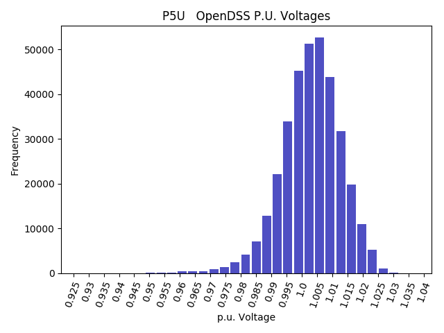
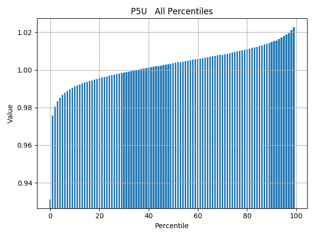

### Full Dataset Analysis

For each dataset, the data from the analysis folder and metrics.csv files of each sub-region are combined into single files that represent the entire dataset. This is provided for each scenario of the dataset.

## Running Powerflow in CYME

CYME simulations can be run using the licensed [CYME software](https://my.cyme.com/), which is a valuable tool for running powerflow and extensive analysis. This work was tested primarily with CYME 9.0 revision 5, and made use of the updated loadflow with profile features provided in the latest release.

It is important to note that due to differences such as different regulator badwidth settings, susceptance values, interpretation of low voltage secondaries and modelling differences between CYME and OpenDSS, difference in the powerflow may exist between the two models. In our work, the CYME and OpenDSS models are interpreted as two different models of the same distribution network.

### CYME Model Creation

Firstly create a new database and select the options to create a "Single Database" of type "Microsoft Access". Choose the location for the database to be saved and confirm that you want to create the database. Once you've selected the database category, you'll be ready to import the SMART-DS data. To import, firstly ensure that you have a connection to the correct CYME database. Press "Import" and select the "CYME ASCII File(s)" option. Then multi-select the network.txt, loads.txt and equipment.txt files for the SMART-DS model you wish to create (often performed using control-click). Select the checkboxes to clear the destination database.
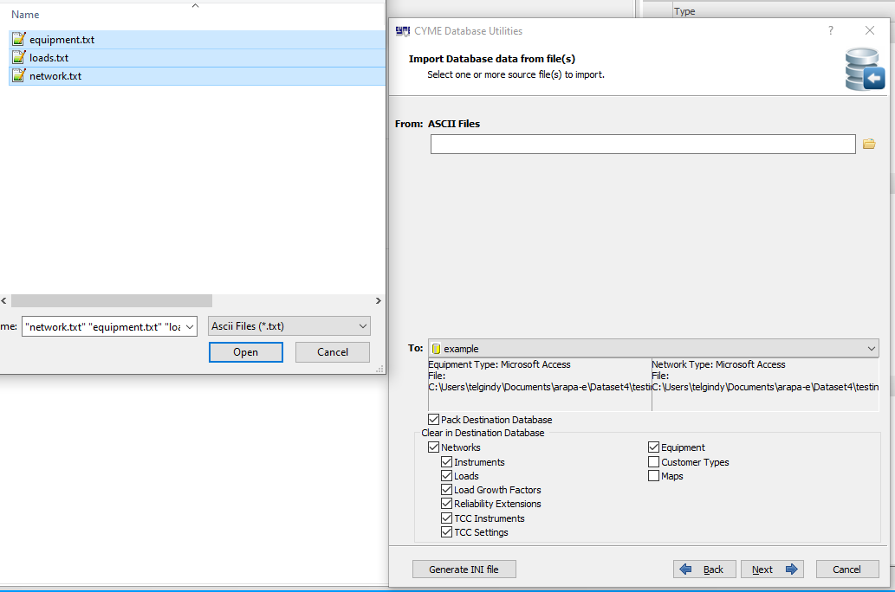

Select import on the following page and then wait for the database to be populated. This may take some time depending on the sub-region selected and speed of your computer. Larger SMART-DS sub-regions may be quite memory intensive in CYME.

### CYME Timeseries Profile Creation

For the timeseries scenarios, it is important to attach timeseries profiles. The loads.txt file contains the maximum kW and kVar value for each load so running loadflow without correctly attaching the profiles will result in under-voltages and equipment overloading.

To create a CYME timeseries database, select "Create Profile/Billing Connection" in the "Profile/Billing" tab of the Data toolbar shown below. In CYME 8 and older, new timeseries databases will have to be created using the CYME profile manager. Select a database of type "Microsoft Access" and choose the location for it to be saved. Select "None" for the Billing Database and confirm the creation of the timeseries database. Once you've selected the database category, you'll be ready to import the SMART-DS timeseries data. Again under the profile/billing tab, press the "Import" button and multi-select the days of the  year that you want to simulate from the timeseries data provided in the cyme_profiles folder for the year in question. If solar simulations are being performed, solar timeseries data will also need to be selected. For example, the profiles cyme_load_timeseries_day_270.txt and cyme_solar_timeseries_day_270.txt will need to be imported for a simulation of the 26th of September 2016 which includes solar instalations. Given the size of timeseries data, simulations of many days may require multiple timeseries databases to be created and run separately.

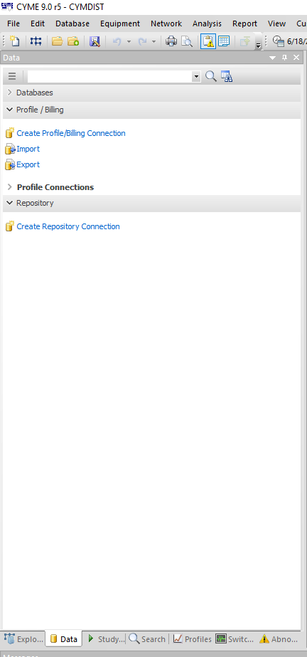

### CYME volt-var and volt-watt Curve Creation

For high and extreme solar scenarios, volt-var and volt-var + volt-watt controls are used, which require the IEEE 1547 Category B curves to be imported into the CYME library. Under the "Equipment" tab, select "Converter Control Curve Model" under "Library". In the pop-up window, press the "Import Equipment" button and select the "1547_VOLT-VAR_CAT_B.cymcfg" file. Repeat this to import the "1547_VOLT-WATT_CAT_B.cymcfg" file. Once the cyme config files have been imported, press "Apply" or "Ok" to import then into your CYME library.


### Exploring CYME Models

Once the database has been successfully populated, you can then select the neworks you wish to view. There may be warnings regarding transferring certain components between networks which is caused by open switches between feeders. The networks for the P12U region are shown below:

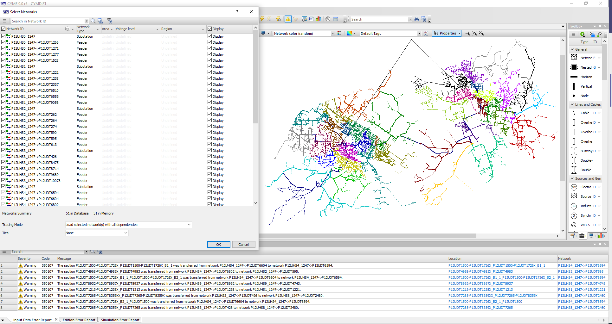

Substations can also be viewed to show bank configurations and feeder connections.


The CYME simplified view can be useful for understanding the connectivity structure of the network
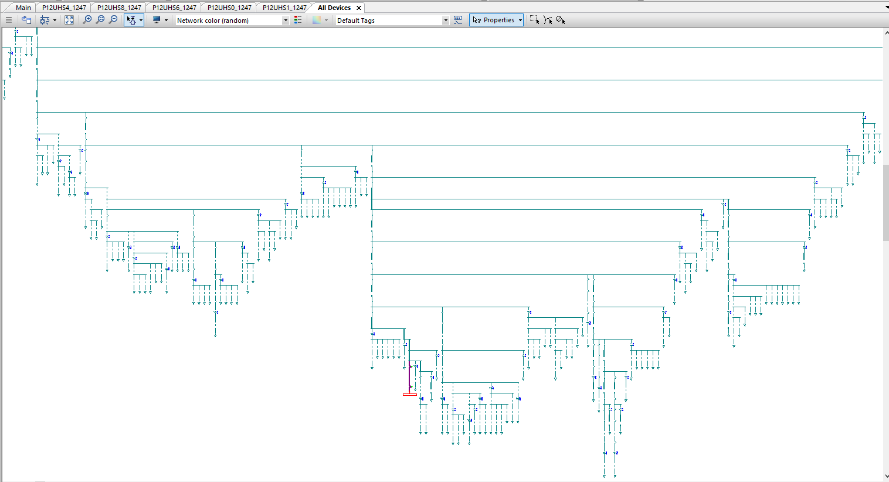

The SMART-DS CYME models can be run as an entire sub-region, or as one or more isolated feeders. When simulating powerflow on feeders, substations must not be among the selected networks.

### Loadflow Analysis for Peak Planning Scenarios in CYME

For peak planning scenarios, select "Load Flow" under the "Analysis" tab. In the pop-up window, under the "Networks" tab ensure all the desired networks are selected. If convergence of powerflow is a problem, under the "Parameters" tab, select "Newton-Raphson" under the Calculation Method, and increase the number of iterations and tolerance under "Convergence Parameters" (e.g. to 0.1% V and 60 iterations). Once all the desired paraemters and output options have been set, press run to simulate powerflow.

### Loadflow Analysis for Timeseries Scenarios in CYME

For peak timeseries scenarios, firstly ensure that you are connected to both the desired database and the desired profile connection for the day(s) that you wish to simulate. In CYME 9 rev 5, these are in the "Data" toolbar under the "Databases" and "Profile/Billing" tabs respectively. Then select "Load Flow with Profiles" under the "Analysis" tab.

In the pop-up window, under the "Networks" tab ensure all the desired networks are selected (they may not be selected by default).

If solar devices are being simulated, in the pop-up window under the "Adjustments" tab ensure that the box marked "Adjust the generators contribution using the profiles" is selected. If this is not selected, all PV units will produce at their maximum rated output rather than based on irradiance profiles for the location. This should not be selected if no solar devices are included in the simulation.

Monitoring of specific devices or output reports can also be set to show time-varying behavior at different points on the network.

If convergence of powerflow is a problem, under the "Parameters" tab, press "edit" on the "Load Flow Parameters" configuration name. In the resulting pop-up window, select "Newton-Raphson" under the Calculation Method, and increase the number of iterations and tolerance under "Convergence Parameters" (e.g. to 0.1% V and 60 iterations).

Analysis of a single timepoint using the load and solar profiles can be performed, or simulation over a time range within the timepoints provided in the profile database and be specified with the correct year, month, day and time.

Once all the desired paraemters and output options have been set, press run to simulate powerflow. If monitored devices were selected, charts can be viewed with selected properties as shown for a single feeder in region P12U for the scenario solar_high_batteries_low:

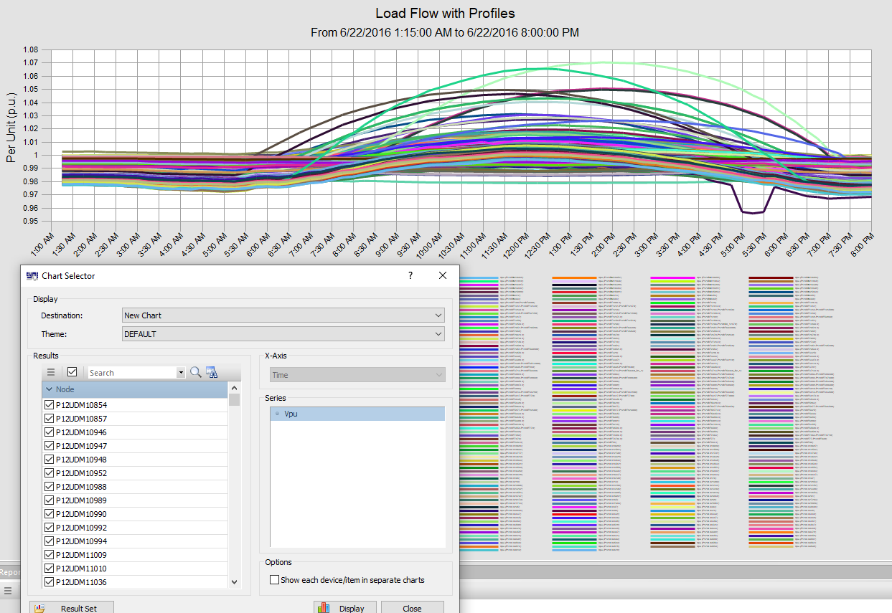

## Running Powerflow in OpenDSS

OpenDSS simulations of the network can be run using the OpenDSS [Graphical User Interface](https://www.epri.com/pages/sa/opendss) (GUI) as well as the  [python](https://github.com/dss-extensions/OpenDSSDirect.py/) and [julia](https://github.com/dss-extensions/OpenDSSDirect.jl) packages to call supported API functions.

It is important to note that due to differences such as different regulator badwidth settings, susceptance values, interpretation of low voltage secondaries and modelling differences between CYME and OpenDSS, difference in the powerflow may exist between the two models. In our work, the CYME and OpenDSS models are interpreted as two different models of the same distribution network.

In some of the high solar scenarios in larger networks, we have occasionally observed convergence issues when running OpenDSS, due to iterations of multiple volt-var and volt-watt controllers. Future SMART-DS or OpenDSS may address these convergence issues.

### Using OpenDSS GUI

To run powerflow using the OpenDSS GUI, ensure that the profiles folder is downloaded as well as all the opendss folder for the relevant scenarios. The opendss files reference the profiles, so maintaining the folder structure is important. Open the Master.dss for the sub-region/substation/feeder of interest and run by selecting all lines and pressing Ctl-D (i.e. DO selected lines). An example of the output for running the SFO region P27U is shown below, with monitor output of kVA and current asd well as the profile plot at the feeder head of p27uhs0_1247--p27udt387 in substation p27uhs0_1247.

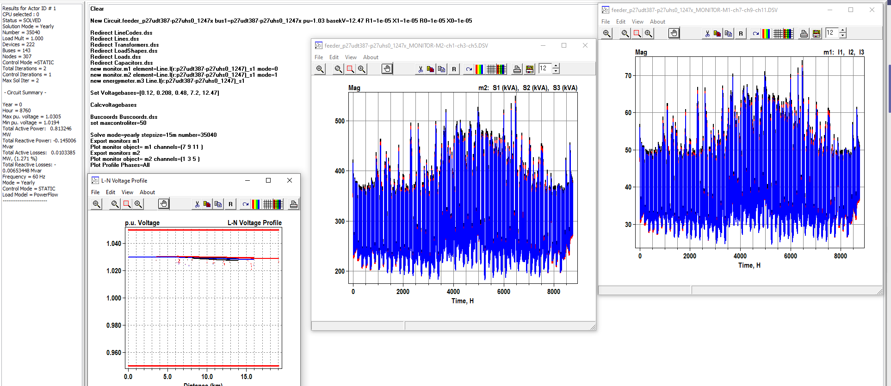

Shorter analysis can be run by adjusting the number of iterations as well as the hour and second that the timeseries run starts from. Using the GUI provides useful visual output, but can be time and memory intensive to run with the current versions of OpenDSS.

### Using opendssdirect

Opendssdirect is a powerful open-source approach to running powerflow in python or julia, and can be integrated into complex code workflows. opendssdirect allows users to set the kw and kvar values of loads. Presently, the fastest way to run opendss powerflow simulations is to set these attributes without reading the loadshape files into memory. By using the opendss files in the opendss_no_loadshapes directory, timeseries data can be set using the data from the parquet files which are located in the "load_data" folder. The yearly profile for each load is provided as a comment at the end of the load definition.

A snippet of python code to update the loads for a single feeder and run powerflow on the resulting network is shown below.

```python

import opendssdirect as dss
import os
import pandas as pd

# File run from scenario folder of SFO P4U e.g.:
# 2016/SFO/P4U/scenarios/solar_high_batteries_none/

substation = 'p4uhs0_4'
feeder = 'p4uhs0_4--p4udt4'
master_file = os.path.join('opendss_no_loadshapes',substation,feeder,'Master.dss')

load_file = os.path.join('opendss_no_loadshapes',substation,feeder,'Loads.dss')
pv_file = os.path.join('opendss_no_loadshapes',substation,feeder,'PVSystems.dss')
summary_file = os.path.join('opendss',substation,feeder,'analysis','Summary_data.csv')

load_data_folder = os.path.join('..','..','load_data')
solar_data_folder = os.path.join('..','..','solar_data')

### Read the summary data file and determine the peak timepoint of the year
### Peak timepoint is in the range of [0,35040)

summary_data = pd.read_csv(summary_file,header=0)
peak_day = summary_data['Peak load day of year'].iloc[0]
peak_hour = summary_data['Peak load hour of day'].iloc[0]
peak_minute = summary_data['Peak load minute of hour'].iloc[0]
peak_timepoint = int(peak_minute/15 + peak_hour*4 + peak_day*96)

### Read the Loads.dss file for the feeder
### Parse the lines and determine the load name, whether or not it is a center-tap load and the timeseries profile that's connected to it.
### Map the load name to the timeseries profile and multiplier

### Center-tap customers have a load connected between neutral and the first active line, and another load between neutral and the second active line. However, in the parquet files in load_data, a single load represents the entire customer. A multiplier of 0.5 is applied to the center-tap loads to avoid double counting them.

load_profile_map = {}
with open(load_file) as f_load:
    for row in f_load.readlines():
        sp = row.split()
        name=None
        profile = None
        multiplier = 1
        for token in sp:
            if token.startswith('Load.'):
                name = token.split('.')[1]
                if name.endswith('_1') or name.endswith('_2'):
                    multiplier = 0.5 # Center-tap loads
            if token.startswith('!yearly'):
                profile_raw = token.split('=')[1]
                if 'mesh' in profile_raw:
                    profile = 'mesh'
                else:
                    profile_sp = profile_raw.split('_')
                    profile = profile_sp[0]+'_'+profile_sp[2]+'.parquet'

            if profile is not None:
                load_profile_map[name] = (profile,multiplier)

### Read the PVSystems.dss file for the feeder
### Parse the lines and determine the pvsystem name, and the timeseries irradiance profile that's connected to it.
### Map the PVSystem name to the timeseries profile

pv_profile_map = {}
with open(pv_file) as f_pv:
    for row in f_pv.readlines():
        sp = row.split()
        name=None
        profile = None
        for token in sp:
            if token.startswith('PVSystem.'):
                name = token.split('.')[1]
            if token.startswith('!yearly'):
                profile = token.split('=')[1]

            if profile is not None:
                pv_profile_map[name] = profile+'_full.csv'


### Read the opendss data into memory without running powerflow

print('starting initial load')
result = dss.run_command("Redirect "+master_file)
print('finished initial load') #Timeseries runs do not include solve in them
print(result,flush=True)


### Read the parquet load file attached to a load.
### Pull the kw and kvar values using the peak timepoint obtained from the summary file.
### Multiplies by 0.5 if the load is a center-tap load
### Use opendssdirect to set the kw and kvar values for each load using dss.Loads.kW(value) and dss.Loads.kvar(value)

dss.Loads.First()
while True:
    name = dss.Loads.Name()
    multiplier = 1

    parquet_name = load_profile_map[name][0]
    multiplier = load_profile_map[name][1] # For center-tap loads
    parquet_data = pd.read_parquet(os.path.join(load_data_folder,parquet_name))
    kw = parquet_data.loc[peak_timepoint, 'total_site_electricity_kw'] * multiplier
    kvar = parquet_data.loc[peak_timepoint, 'total_site_electricity_kvar'] * multiplier
    dss.Loads.kW(kw)
    dss.Loads.kvar(kvar)

    if not dss.Loads.Next() > 0:
        break

### Read the csv solar file attached to a PVsystems object.
### Pull the irradiance value values using the peak timepoint obtained from the summary file.
### Convert from W/m^2 to kW/m^2
### Use opendssdirect to set the irradiance for each PVsystems object using dss.PVsystems.Irradiance(value)


first_pv = dss.PVsystems.First()
while True and first_pv > 0: # Check that there is a PVsystems object on the network
    name = dss.PVsystems.Name()

    csv_name = pv_profile_map[name]
    csv_data = pd.read_csv(os.path.join(solar_data_folder,csv_name),header=0)
    irradiance = csv_data.loc[peak_timepoint,'PoA Irradiance (W/m^2)']
    res1 = dss.PVsystems.Irradiance(irradiance/1000)

    if not dss.PVsystems.Next() > 0:
        break


### Now run powerflow with the load values set

print('starting timeseries run')
result = dss.run_command(f"Solve")

print('finished timeseries run')
print(result)

### Loop through all the buses and determine their per-unit voltage
### The dss.Bus.PuVoltages() provides real and imaginary voltage componants on each phase of the bus
### The magnitude of the voltage is then determined
### A dictionary mapping loads to voltages is then updated with the voltage magnitude

dss_map = {}
names = dss.Circuit.AllBusNames()
for name in names:
    dss.Circuit.SetActiveBus(name)
    dss_pus = dss.Bus.PuVoltage()
    tot = 0
    cnt = 0
    for i in range(int(len(dss_pus)/2)):
        mag = abs(complex(dss_pus[2*i],dss_pus[2*i+1]))
        if mag > 0:
            tot += mag
            cnt+=1
    if cnt == 0:
        tot = 0
    else:
        tot = tot/cnt
    if tot > 0:
        dss_map[name] = tot

for name in dss_map:
    print(name,dss_map[name])

```

### Appendix 1. Scenario Descriptions

#### Customer Solar

The placements for customer solar are generated by selecting a percentage of customer loads at random from each feeder with a seed of 1.  The peak kW solar capacity for each PV installation is determined by building area and customer class according to the following tables:

|Land Area (sq ft) | Residential Installation Size (kW) |
|---|---|
|<75| 3|
|75-300 | 5|
|>300| 8|

|Land Area (sq ft) | Commercial Installation Size (kW) |
|---|---|
|<100| 3|
|100-300 | 6|
|300-600| 8|
|600-1000| 40|
|1000-2000| 100|
|>2000| 300|

The total amount of PV installed on a feeder is also restricted by the total coincident annual peak load on that feeder. PV installations are capped at a fixed percentage of the total load shown in the table below.

Scenarios are nested, so the low scenario is a subset of the medium scenario which is a subset of the high scenario etc. The inverter technology in each subsequent scenario becomes more sophisticated, but does not replace the inverter technology of existing devices. This means that if no installations are capped, a high scenario will have 15% of loads with unity power factor, 20% of loads with powerfactor of -0.95  and 30% of loads with volt-var controllers.

|Scenario | Percentage of loads selected | Maximum kW distributed solar installed  (Percentage of Feeder Peak kW) | Solar Technology|
|--|--|--|--|
|Low|15%|15%|Unity power factor|
|Medium| 35%| 75%|-0.95 power factor (absorbing)|
|High| 65%| 150%|Volt-Var (IEEE 1547-Category B)
|Extreme|85%|None| Volt-Var and Volt-Watt (IEEE 1547-Category B)

#### Utility Solar

Utility scale solar is installed at the first recloser of the distribution system. No two reclosers in the distribution system are in series. Each utility scale solar installation is 2 MW in size and powerfactor of 0.95. As with distributed solar installations, utility installations are capped by the maximum load on the feeder. The maximum amount of utility scale solar is determined independently from the customer solar cap as described below:

|Scenario|Percentage of feeders with 1 utility PV installations|Percentage of feeders with 2 utility PV installation|Maximum kW utility solar installed (Percentage of Feeder Peak kW)|
|--|--|--|--|--|
|Low|0%|0%|0%|
|Medium|50%|0%|33%|
|High|100%|75%|80%|
|Extreme|100%|75%|100%|

#### Customer Batteries

Customer batteries are placed using the same random seed as customer solar, which means that a 35% battery placement will have the same locations as a 35% solar placement (assuming no cap on solar installations). The size of each battery installation is determined by the size of the PV installation at the same location as shown in the table below. For the integrated scenarios, if there is no solar attached at the loadpoint, a default battery size of 8 kW is used. The kWh capacity of batteries is sized at double their kW rating.

|Installed PV capacity (kW)|Installed battery size (kW) |
|--|--|
|<4|4|
|4-10|8|
|10-150|25|
|>150|100|

Adoption levels of customer battery scenarios are shown below:

|Scenario|Percentage of Loads Selected|
|--|--|
|Low|5%|
|High|35%|

#### Utility Batteries

Utility scale storage is placed at the low-side of the transformers within substations. If two transformers exist within the substation, an additional Battery Energy Storage System (BESS) is added to 75% of substations in the high scenario:

|Scenario|Percentage of substations with 1 utility BESS installation|Percentage of substations with 2 utility BESS installations|
|--|--|--|
|Low|0%|0%|
|High|100%|75%|

#### Small Demand Responsive Loads

This applies to loads that have a peak planning load of less than 200 kW. A random seed of 2 (different from solar and batteries) is used to select the loads under 200 kW for each scenario according to the following table:

|Scenario|Percentage of loads selected|
|--|--|
|Low|5%|
|Medium|30%|
|High|75%|

#### Large Demand Responsive Loads

This applies to loads that have a peak planning load of  greater than or equal to 200 kW. A random seed of 2 (different from solar and batteries) is used to select the loads over 200 kW for each scenario according to the following table:

|Scenario|Percentage of loads selected|
|--|--|
|Low|15%|
|Medium|50%|
|High|100%|

#### Grid Monitoring Equipment

This placement describes loads that have Advanced Metering Infrastructure (AMI) installed. This placement is applied to all loads. The random seed used for this placement is 3 (different from solar, battery and demand response adoption):

|Scenario|Percentage of loads selected|
|--|--|
|Low|5%|
|Medium|15%|
|High|75%|
|Extreme|100%|

#### Residential Electric Vehicles

Electric vehicle placements are applied to loads. The loads are filtered based on whether the customer is commercial or residential, with different percentages of uptakes applied to the two customer classes. For residential customers, the high and extreme placements have a second electric vehicle added. The random seed used for this placement is 4 for both the first and second car, so the additional EVs are located at loads which first adopted one electric vehicle.

|Scenario|Percentage of residential loads selected for first EV|Percentage of residential loads selected for second EV|
|--|--|--|
|Low|5%|0%|
|Medium|30%|0%|
|High|60%|15%|
|Extreme|75%|45%|

#### Commercial Electric Vehicles

Electric vehicle placements are applied to loads. The loads are filtered based on whether the customer is commercial or residential, with different percentages of uptakes applied to the two customer classes. For commercial customers, it is assumed that the EV loads represent charging stations rather than individual car chargers, therefore the exact number of plugs is indeterminate. The random seed used for this placement is also 4

|Scenario|Percentage of commercial loads selected|
|--|--|
|Low|5%|
|Medium|30%|
|High|75%|
|Extreme|100%|

#### Line Outages

Outage scenarios are applied to lines (not switches, reclosers or fuses). The low and medium scenarios select a fixed number of lines, and the high and extreme scenarios select a percentage of lines. As with the other random placements, the low scenario is a subset of the medium scenario which is a subset of the high scenario whenever 3 lines is less than 2% of the total number of lines.  A seed of 1 is used for this placement. This seed is  different from solar and battery placement seeds because lines are selected instead of loads.

|Scenario |Percentage or count of lines selected|
|--|--|
|Low|1|
|Medium|3|
|High|2%|
|Extreme|20%|
